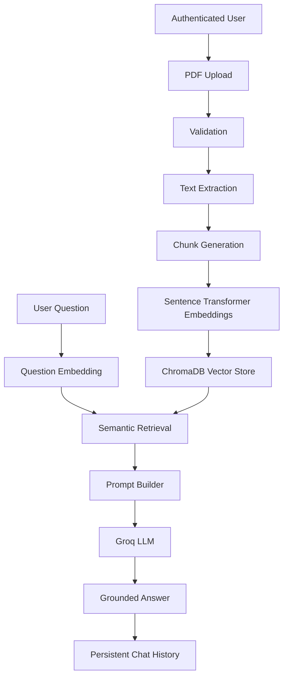

# DocuMind - AI Legal & Financial Document Analyst

DocuMind is an AI-powered document intelligence platform for analyzing legal and financial PDF documents. It provides a secure Django application where authenticated users can upload documents, process them into searchable chunks, and ask grounded questions against the document content.

The system is built around Retrieval-Augmented Generation (RAG). Uploaded PDFs are validated, extracted, chunked, embedded with Sentence Transformers, stored in ChromaDB, retrieved semantically, and passed into a Groq-powered language model with a strict grounded prompt. Answers are saved in persistent document chat sessions with source references.

DocuMind is designed as a production-oriented Django application with clear service boundaries, user-scoped document isolation, environment-driven configuration, local SQLite support, and PostgreSQL readiness for deployment.

## Key Highlights

- Secure authentication using Django's built-in user model
- PDF upload with validation and file-size limits
- PDF text extraction and page counting
- Intelligent text chunking with overlap
- Sentence Transformer embedding generation
- ChromaDB vector database storage
- Semantic retrieval scoped to a selected document
- Groq LLM integration
- Grounded AI answers from retrieved chunks
- Source citations and chunk previews
- Persistent document chat history
- User-scoped document and chat isolation
- SQLite for local development
- PostgreSQL for production via `DATABASE_URL`
- Internal engineering documentation in `documentation/`

## System Architecture

Implemented document intelligence pipeline:

```text
PDF Upload
-> Validation
-> Text Extraction
-> Chunk Generation
-> Embedding Generation
-> ChromaDB Storage
-> Semantic Retrieval
-> Prompt Construction
-> Groq LLM
-> Grounded Response
-> Persistent Chat
```



## Technology Stack

### Backend

- Python
- Django
- Django REST Framework
- SQLite for local development
- PostgreSQL for production
- django-environ
- django-cors-headers

### AI

- Sentence Transformers
- ChromaDB
- Groq API
- Retrieval-Augmented Generation
- pypdf

### Frontend

- Django Templates
- HTML
- Tailwind CSS
- Vanilla JavaScript

## Installation

Clone the repository:

```bash
git clone https://github.com/salamlakhan7/DocuMind-AI-Legal-Financial-Document-Analyst.git
cd DocuMind-AI-Legal-Financial-Document-Analyst
```

Create and activate a virtual environment:

```bash
python -m venv .venv
```

Windows:

```bash
.venv\Scripts\activate
```

macOS/Linux:

```bash
source .venv/bin/activate
```

Install dependencies:

```bash
pip install -r requirements.txt
```

Create a local environment file:

```bash
cp .env.example .env
```

Apply database migrations:

```bash
python manage.py migrate
```

Create an admin user:

```bash
python manage.py createsuperuser
```

Run the development server:

```bash
python manage.py runserver
```

Open the application:

```text
http://127.0.0.1:8000/
```

## Environment Variables

Use placeholders only in committed files. Local secrets belong in `.env`, which is ignored by Git.

```env
SECRET_KEY=
DEBUG=True
DATABASE_URL=
GROQ_API_KEY=
ALLOWED_HOSTS=
CSRF_TRUSTED_ORIGINS=
CORS_ALLOWED_ORIGINS=
```

## Database Configuration

SQLite is used automatically for local development when `DATABASE_URL` is not provided.

PostgreSQL is used in production when `DATABASE_URL` is present. The application switches database backends based on environment configuration, so no code changes are required between local development and production deployment.

```text
DATABASE_URL empty     -> SQLite at BASE_DIR / db.sqlite3
DATABASE_URL provided  -> PostgreSQL via django-environ
```

## Project Structure

```text
DocuMind-AI-Legal-Financial-Document-Analyst/
├── apps/
│   ├── accounts/
│   ├── chat/
│   ├── core/
│   └── documents/
├── config/
│   ├── settings.py
│   ├── urls.py
│   ├── asgi.py
│   └── wsgi.py
├── documentation/
├── media/
├── services/
│   ├── llm/
│   ├── pdf/
│   └── rag/
│       └── vector_store/
├── static/
├── templates/
├── vector_store/
├── manage.py
├── requirements.txt
├── .env.example
├── .gitignore
└── README.md
```

## Engineering Documentation

The `documentation/` directory contains internal engineering documentation for maintainers and reviewers:

- Project overview
- System architecture
- Application architecture
- Database design
- AI pipeline
- Vector database design
- Document processing lifecycle
- Security considerations
- Deployment architecture
- Testing report
- Current limitations
- Version history

Start with [Project Overview](documentation/01_PROJECT_OVERVIEW.md) and [System Architecture](documentation/02_SYSTEM_ARCHITECTURE.md).

## Screenshots

Screenshots will be added after production deployment and final UI capture.

### Landing Page

Screenshot placeholder.

### Dashboard

Screenshot placeholder.

### Document Upload

Screenshot placeholder.

### Document Chat

Screenshot placeholder.

### Retrieval

Screenshot placeholder.

### History

Screenshot placeholder.

## Live Demo

Coming after production deployment.

## Roadmap

- Asynchronous document processing with Celery or RQ
- Background embedding and vector storage jobs
- OCR support for scanned PDFs
- Multi-document querying
- Redis caching
- Production monitoring and observability
- Docker support
- Kubernetes deployment
- CI/CD pipeline
- Automated unit and integration testing
- Multi-model LLM support
- Streaming AI responses
- Advanced role and organization support

## License

MIT

## Author

Abdul Salam

GitHub: [https://github.com/salamlakhan7](https://github.com/salamlakhan7)

LinkedIn: [https://www.linkedin.com/in/abdul-salam-501b2025b/](https://www.linkedin.com/in/abdul-salam-501b2025b/)

Email: [salamlakhan7@gmail.com](mailto:salamlakhan7@gmail.com)
